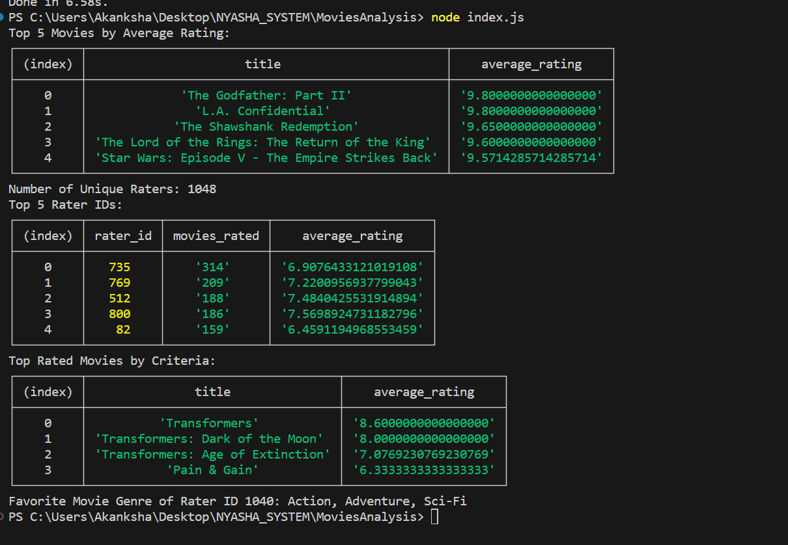

# MoviesAnalysis

## Step 1: Install Dependencies
Ensure you have Node.js installed on your machine. Then, run the following command to install project dependencies:

```bash
npm install
```

```bash
npm install node 
```


